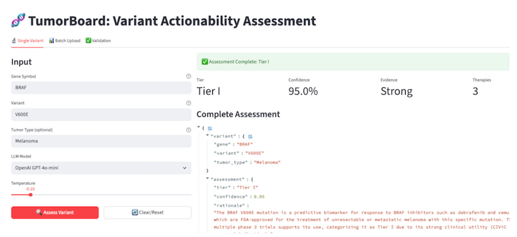
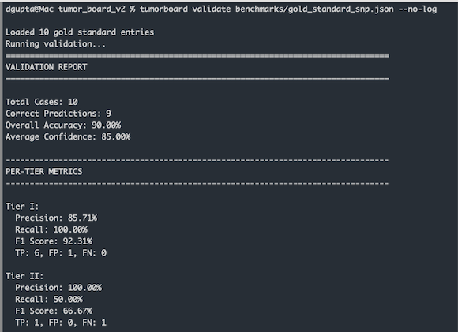

# TumorBoard v2
An AI-powered tool for assessing cancer variant actionability with integrated validation.

**Current Validation Performance: 82% accuracy | 89% Tier I F1 score**

**TL;DR**:  
Precision oncology depends on expert molecular tumor boards to determine whether genetic variants found in 
tumors are clinically 'actionable'—that is, whether they have associated FDA-approved therapies or clinical 
guidelines. This is a complex, manual process involving synthesis of evidence from multiple databases.

TumorBoard v2 automates and mimics this expert workflow by aggregating evidence from key genomic and drug-labeling 
databases (CIViC, ClinVar, COSMIC, FDA) and uses large language models (LLMs) to assign standardized 
AMP/ASCO/CAP tiers indicating clinical actionability levels. All AI decision rationale and evidence sources are 
fully logged for transparency and auditability. A built-in validation framework benchmarks AI predictions against 
expert-labeled “gold-standard” variant classifications.

Note: Currently, this tool supports only single nucleotide polymorphisms (SNPs) and small insertions/deletions (indels).  
It is a research prototype exploring AI-assisted decision-making and is not intended for clinical use.  

**Coming Soon TL;DR – The Real AI Tumor Board**
- Full RAG stack (PubMed, ClinicalTrials.gov, NCCN/ESMO guidelines,..)
- New evidence sources: SpliceAI, TCGA prevalence, ClinicalTrials.gov integration
- Patient VCF Files:
Supports analysis from single variants to whole patient exomes/genomes by uploading VCF files, performing 
variant prioritization, and generating comprehensive clinical reports with trial matching.
- Two-phase agentic architecture:  
  → Collaborative phase: parallel specialized agents (Literature, Pathways, Trials, Guidelines, etc.)  
  → Adversarial phase: Advocate vs. Skeptic debate → Arbiter assigns final tier  
  → Configurable meta-rules decide who speaks when, when to dig deeper, and when to escalate  
  → Semantic embeddings and a knowledge graph to store and retrieve the history of agent debates

The result: higher accuracy, transparent debate traces, and reasoning that closely resembles a real multidisciplinary panel.

### Quick Start (Docker)

```bash
git clone https://github.com/dami-gupta-git/tumor_board_v2
cd tumor_board_v2
cp .env.example .env  

# Add your API keys to .env
cd streamlit
docker compose up --build

# Open http://localhost:8501
```
See **[Streamlit App Guide](streamlit/README.md)** for full details on the web interface.

  
### Screenshots
**Web UI**  
  
 
**Validator**  



## Overview

TumorBoard models the expert application of the **AMP/ASCO/CAP 4-tier classification system**.

Available in two interfaces:
- **Streamlit Web App**: Modern single-container web interface
- **Command-Line Interface**: Python CLI tool for batch processing and automation

### Key Features

- **Evidence Aggregation**: Fetches from CIViC, ClinVar, COSMIC, FDA drug approvals, CGI Biomarkers, VICC MetaKB, and AlphaMissense
- **VICC MetaKB Integration**: Harmonized evidence from 6 major cancer variant knowledgebases (CIViC, CGI, JAX-CKB, OncoKB, PMKB, MolecularMatch)
- **LLM Tiering**: Assigns AMP/ASCO/CAP tiers with confidence scores and rationale
- **Smart Evidence Prioritization**: Surfaces tumor-specific sensitivity evidence first; correctly interprets resistance markers
- **Validation Framework**: Built-in benchmarking against gold standard datasets
- **Multi-LLM Support**: OpenAI, Anthropic, Google, Groq via litellm

See **[Full Feature List](FEATURES.md)** for variant normalization, functional annotations, and more.


## Why This Tool Exists

Molecular tumor boards face significant challenges:

Variant classification for tumor boards is:

1. Resource Intensive: Manual variant review is slow, requiring deep expertise and coordination.
2. Incomplete: No single database fully covers all variants or tumor contexts.
3. Fragmented: Evidence is scattered across multiple sources, demanding extensive manual integration.
4. Rapidly Evolving: Clinical evidence, trials, and approvals constantly change, challenging up-to-date assessments.  

TumorBoard tackles these challenges by automating evidence synthesis and triaging variant actionability with 
AI, aiming to improve speed, coverage, and transparency.


## Disclaimer

**Limitations:**
- LLMs may hallucinate or misinterpret evidence 
- Pattern matching ≠ expert clinical judgment  
- Requires validation against gold standards (hence the built-in framework)
- Evidence quality: Depends on database coverage
- Novel variants: Limited data for rare variants
- Context windows: Very long evidence may be truncated

**This tool is for research purposes only.** Clinical decisions should always
be made by qualified healthcare professionals.

## Summary Roadmap 

### Enhanced Evidence Sources
SpliceAI, TCGA prevalence data, and ClinicalTrials.gov integration. AlphaMissense pathogenicity predictions are now integrated.

### RAG Pipeline
Indexed PubMed abstracts, clinical trial matching, NCCN/ESMO guideline retrieval, and variant lookups for rare mutations.

### Agentic AI Architecture
A two-phase multi-agent system that first performs collaborative evidence gathering through specialized agents 
(e.g., Literature, Trials, Pathways), followed by an adversarial debate between Advocate and Skeptic agents 
where an Arbiter assigns the final clinical actionability tier; this process leverages semantic embeddings and a 
knowledge graph to store and retrieve the complete history of agent debates, enhancing reasoning transparency and 
accuracy.

### Patient-Level Analysis
VCF upload, whole-exome/genome processing, variant prioritization, and comprehensive clinical report generation.

See **[Full Roadmap](ROADMAP.md)** for detailed feature descriptions and implementation plans.

## Getting Started

### Pick Your Interface

**Option 1: Web Application (Docker - Recommended)**

Use the Streamlit web interface with zero local setup:

```bash
# 1. Set API keys
cd streamlit
cp .env.example .env
# Edit .env with your API keys

# 2. Start the app
docker compose up --build

# 3. Open http://localhost:8501
```

---

**Option 2: CLI Tool (Requires pip install)**

Use the command-line interface for batch processing and validation:

```bash
# 1. Clone and install
git clone https://github.com/dami-gupta-git/tumor_board_v2
cd tumor_board_v2
pip install -e .

# 2. Set API key
export OPENAI_API_KEY="your-key-here"

# 3. Use CLI commands
tumorboard assess BRAF V600E --tumor "Melanoma" --no-log
tumorboard batch benchmarks/sample_batch.json --no-log
tumorboard validate benchmarks/gold_standard.json --no-log
```

**Alternative Large Language Models:**
```bash
# Use Anthropic Claude 3 Haiku
export ANTHROPIC_API_KEY="your-key-here"
tumorboard assess BRAF V600E --model claude-3-haiku-20240307

# Use Google Gemini
export GOOGLE_API_KEY="your-key-here"
tumorboard assess BRAF V600E --model gemini/gemini-1.5-pro

# Use Groq Llama
export GROQ_API_KEY="your-key-here"
tumorboard assess BRAF V600E --model groq/llama-3.1-70b-versatile
```

## LLM Decision Logging

All LLM decisions are logged to `./logs/llm_decisions_YYYYMMDD.jsonl` (enabled by default, disable with `--no-log`). Captures request details, tier decisions, confidence scores, rationale, and errors.

See **[Logging Documentation](logging.md)** for log format, analysis examples with Python/jq, and best practices.

## CLI Reference

| Command | Description |
|---------|-------------|
| `tumorboard assess BRAF V600E --tumor Melanoma` | Assess single variant |
| `tumorboard batch variants.json` | Process multiple variants |
| `tumorboard validate gold_standard.json` | Benchmark against gold standard |

See **[Full CLI Documentation](CLI.md)** for all options, output formats, and alternative model configuration.

## AMP/ASCO/CAP Tier System

- **Tier I**: Variants with strong clinical significance
  - FDA-approved therapies for specific variant + tumor type
  - Professional guideline recommendations
  - Strong evidence from clinical trials

- **Tier II**: Variants with potential clinical significance
  - FDA-approved therapies for different tumor types
  - Clinical trial evidence
  - Case reports or smaller studies

- **Tier III**: Variants of unknown clinical significance
  - Preclinical evidence only
  - Uncertain biological significance
  - Conflicting evidence

- **Tier IV**: Benign or likely benign variants
  - Known benign polymorphisms
  - No oncogenic evidence


## Variant Normalization

Automatically standardizes variant notations (`Val600Glu` → `V600E`, `p.V600E` → `V600E`) for better database matching. Supports SNPs and small indels; rejects fusions, amplifications, and other structural variants.

See **[Variant Normalization Details](VARIANT_NORMALIZATION.md)** for supported formats and programmatic usage.

## Variant Annotations

Extracts COSMIC, dbSNP, ClinVar IDs, HGVS notations, PolyPhen2/CADD scores, gnomAD frequencies, AlphaMissense pathogenicity predictions, and FDA drug approvals from MyVariant.info.

See **[Variant Annotations Details](VARIANT_ANNOTATIONS.md)** for the full list of extracted fields.

## Configuration

**Models:** OpenAI (gpt-4o-mini), Anthropic, Google Gemini, Groq via litellm
**Data:** MyVariant.info (CIViC, ClinVar, COSMIC) + FDA openFDA API


## Contributing

See [CONTRIBUTING.md](CONTRIBUTING.md) for development setup, testing, and code quality guidelines.

## License & Citation

**Author:** Dami Gupta (dami.gupta@gmail.com)

**License:** MIT License

**Citation:** If you use TumorBoard in your research, please cite:

```bibtex
@software{tumorboard2025,
  author = {Gupta, Dami},
  title = {TumorBoard: LLM-Powered Cancer Variant Actionability Assessment},
  year = {2025},
  url = {https://github.com/dami-gupta-git/tumor_board_v2}
}
```

## References

- [AMP/ASCO/CAP Guidelines](https://www.ncbi.nlm.nih.gov/pmc/articles/PMC5707196/)
- [MyVariant.info](https://myvariant.info/) | [CIViC](https://civicdb.org/) | [ClinVar](https://www.ncbi.nlm.nih.gov/clinvar/) | [COSMIC](https://cancer.sanger.ac.uk/cosmic)
- [FDA openFDA API](https://open.fda.gov/) | [Drugs@FDA](https://www.fda.gov/drugs/drug-approvals-and-databases/drugsfda-data-files)
- [VICC MetaKB](https://search.cancervariants.org/) | [CGI Biomarkers](https://www.cancergenomeinterpreter.org/biomarkers)

---

**Note**: This tool is for research purposes only. Clinical decisions should always be made by qualified healthcare professionals.
